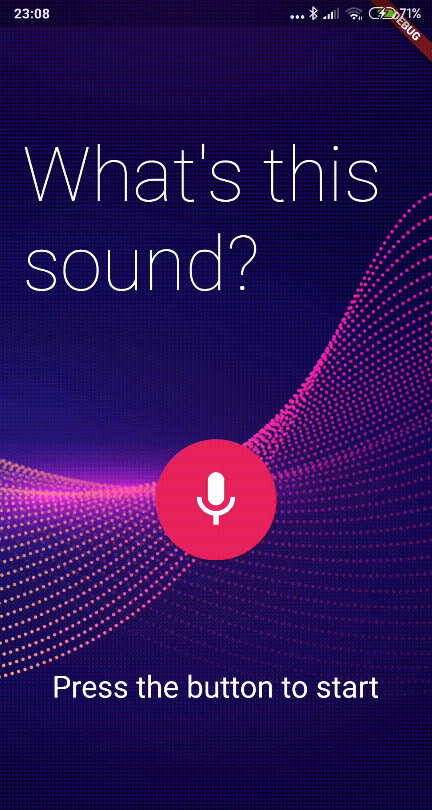

[![MIT License][license-shield]][license-url]
[![Medium][medium-shield]][medium-url]
[![LinkedIn][linkedin-shield]][linkedin-url]


<h1 align="center"> Audio Recognition App</h1> <br>
<p align="center">Simple audio recognition application developed in Flutter using Tensorflow Lite framework to integrate a sound classification model</p>

<p align="center">
    
</p>


## Tecnologies

This application was developed using a cross-platform framework that allows multi-operanting systems support namely iOS and Android:

- [Flutter](https://flutter.dev) cross-platform framework 
- [Tensorflow Lite](https://www.tensorflow.org/lite) used to integrate machine learning models into mobile applications

## How to run

As a requirement, it is necessary to have Flutter already installed. To run the mobile application:

1. Get flutter dependencies:

```
flutter pub get
```

2. After mobile device connected, run the application doing:

```
flutter run
```

This [article]() explores not only how this app was developed but also how to prepare both environments (Android and iOS) for the Tensorflow Lite.

## Authors
<a href="https://github.com/cmalbuquerque/audio_recognition_app/graphs/contributors">
  
</a>


[forks-shield]: https://img.shields.io/github/forks/github_username/repo.svg?style=for-the-badge
[forks-url]: https://github.com/github_username/repo/network/members
[stars-shield]: https://img.shields.io/github/stars/github_username/repo.svg?style=for-the-badge
[stars-url]: https://github.com/github_username/repo/stargazers
[issues-shield]: https://img.shields.io/github/issues/github_username/repo.svg?style=for-the-badge
[issues-url]: https://github.com/github_username/repo/issues
[license-shield]: https://img.shields.io/github/license/github_username/repo.svg?style=for-the-badge
[license-url]: https://github.com/github_username/repo/blob/master/LICENSE.txt
[medium-shield]: https://img.shields.io/badge/-Medium-black.svg?style=for-the-badge&logo=medium&colorB=555
[medium-url]: https://
[linkedin-shield]: https://img.shields.io/badge/-LinkedIn-black.svg?style=for-the-badge&logo=linkedin&colorB=555
[linkedin-url]: https://linkedin.com/in/github_username
